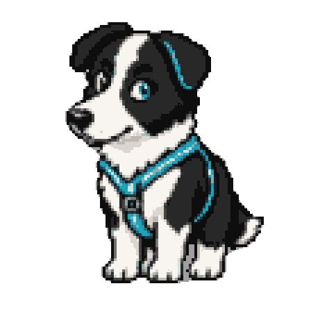

# Hi, I'm Alexandre Tostivint 👋

**Cloud architecture · Homelab · Side projects**

I'm a cloud architect who enjoys building things, understanding how they work, and trying ideas out. My interests range from cloud architecture to homelab infrastructure and small creative projects.

## What I'm working on

- Exploring my next opportunity in cloud architecture
- Building a BC-250
- Setting up a single-node Kubernetes cluster on LXC

## Cloud & homelab

**Homelab footprint (local state/config):** 1 Proxmox node · 3 virtual machines (2 Terraform-managed) · 6 LXC containers.

**Home Assistant:** ~577 entities, including 339 active in the inventory snapshot from 20 August 2026.

Proxmox · Home Assistant · YunoHost for private services · Kubernetes · AWS · Cloudflare

**AI tooling:** Experimenting with Hermes Agent, Codex, and OpenCodeGo.

## Side project

[**SmokeyRoadRage**](https://github.com/atostivint/SmokeyRoadRage) · A game jam project.

---

This introduction was created with the help of my AI assistant.

  

