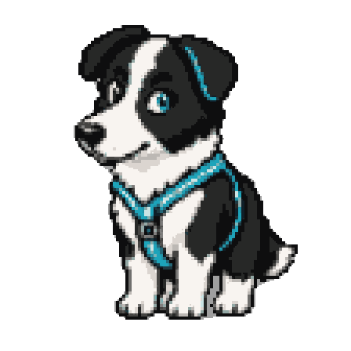

# Hi, I'm Alexandre Tostivint 👋

**Senior Cloud / Solutions Architect · AWS · FinOps · Automation**

I help teams design cloud architectures, understand the trade-offs, and turn them into working systems. My work spans cloud consulting, technical pre-sales, infrastructure automation, and cost optimization, with AWS as my main platform alongside Azure and GCP.

I enjoy building things, understanding how they work, and sharing what I learn.

## What I'm working on

- **Cloud architecture and FinOps:** reliable infrastructure, Well-Architected reviews, and practical decisions about cost and operations.
- **Kubernetes and GitOps:** running a personal k3s homelab on Proxmox, with Terraform, Ansible, and Flux.
- **AI tooling:** experimenting with agent memory, MCP integrations, and adaptive reasoning effort.

## Tools I work with

**Cloud:** AWS · Azure · GCP  
**Infrastructure:** Terraform · CloudFormation · Ansible · Kubernetes · Docker · Flux  
**Automation:** Python · Bash · CI/CD  
**Architecture:** FinOps · AWS Well-Architected · serverless · security and governance

## Let's connect

Based near Rennes, France. I work in French and English, and I'm open to cloud architecture opportunities, consulting, and technical collaboration.

[Portfolio](https://alexandre.tostivint.bzh/) · [LinkedIn](https://www.linkedin.com/in/alexandretostivint/)

  

